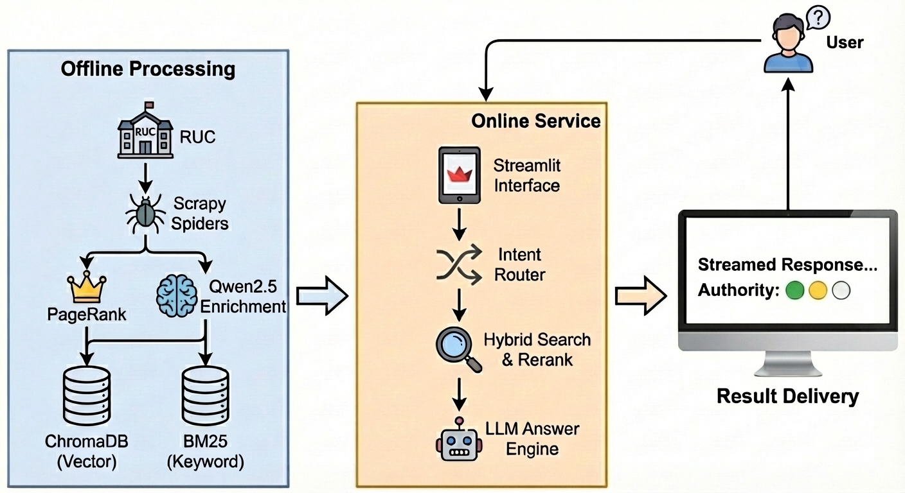

# 🎓 Enhanced RUC Search (增强版人大校园搜索)

基于 **RAG (检索增强生成)** 与 **PageRank** 算法构建的下一代校园智能问答系统。



## ✨ 核心特性

*   **🔍 精准权威**: 引入 **PageRank** 算法，优先展示官方权威信息，解决“转载刷屏”问题。
*   **🧠 深度理解**: 利用 **Qwen2.5** 进行数据增强与意图识别，支持模糊语义搜索。
*   **🛡️ 智能去重**: 独创 **SimCheck** 机制，自动过滤多部门转载的重复通知。
*   **💬 流畅交互**: 清新 **Streamlit** 界面，支持流式问答与信源溯源。

## 🚀 快速开始

### 1. 环境准备
```bash
pip install -r requirements.txt
```

### 2. 启动服务
```bash
# 启动前端界面
streamlit run frontend/app.py
```

## 📚 更多文档

*   [项目技术报告 (Project Report)](docs/PROJECT_REPORT.md) - 包含详细的技术架构与中间结果。
*   [详细开发文档 (Detailed Guide)](docs/DETAILED_README.md) - 包含原本的开发路线图与任务拆解。
